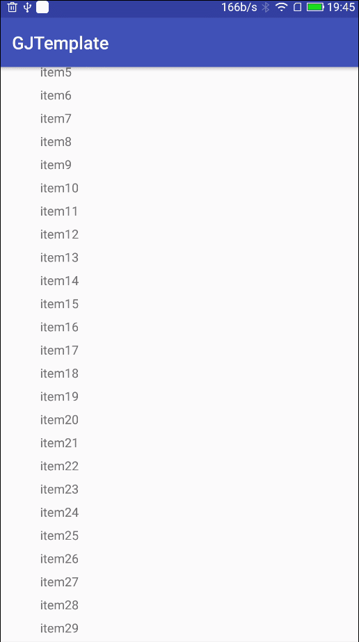

# RecyclerViewExtend

---
## 效果展示

---
## 介绍说明
* 增加滑动到底部加载更多监听器
* 增加无item时显示提示视图,通过RecyclerViewExtend.setEmptyView()设置
---
## 使用说明
* 添加xml
```xml
<android.support.v4.widget.SwipeRefreshLayout
            android:id="@+id/srl_refresh"
            android:layout_width="match_parent"
            android:layout_height="wrap_content">

            <RelativeLayout
                android:layout_width="match_parent"
                android:layout_height="match_parent">

                <com.gosuncn.rve.RecyclerViewExtend
                    android:id="@+id/rv_list"
                    android:layout_width="match_parent"
                    android:layout_height="match_parent" />

                <TextView
                    android:id="@+id/tv_empty"
                    android:layout_width="match_parent"
                    android:layout_height="match_parent"
                    android:gravity="center"
                    android:text="没有数据？下拉刷新一下~"
                    android:textColor="@color/colorAccent" />
            </RelativeLayout>

</android.support.v4.widget.SwipeRefreshLayout>
```
* 代码使用
```java
        binding.rvList.setLayoutManager(new LinearLayoutManager(this));
        binding.rvList.setAdapter(adapter=new ListAdapter(this));
        binding.rvList.setLoadingMode(RecyclerViewExtend.LOADINGMODE_SLIDE_TO_BOTTOM_AND_PULL_UP);
        binding.rvList.setEmptyView(binding.tvEmpty);
        binding.srlRefresh.setOnRefreshListener(new SwipeRefreshLayout.OnRefreshListener() {
            @Override
            public void onRefresh() {
                ...
            }
        });
    binding.rvList.setOnLoadingListener(new RecyclerViewExtend.OnLoadingListener() {
        @Override
        public void onLoading() {
            Toast.makeText(MainActivity.this, "正在加载。。。", Toast.LENGTH_SHORT).show();
            ...
        }
    });
```
* 详细请参照demo和查看在线文档

---
## JavaDoc文档

* [在线JavaDoc](https://jitpack.io/com/github/huweijian5/RecyclerViewExtend/1.0.0/javadoc/index.html)
* 网址：`https://jitpack.io/com/github/huweijian5/RecyclerViewExtend/[VersionCode]/javadoc/index.html`
* 其中[VersionCode](https://github.com/huweijian5/RecyclerViewExtend/releases)请替换为最新版本号
* 注意文档使用UTF-8编码，如遇乱码，请在浏览器选择UTF-8编码即可

---
## 引用

* 如果需要引用此库,做法如下：
* Add it in your root build.gradle at the end of repositories:
```
allprojects {
		repositories {
			...
			maven { url "https://jitpack.io" }
		}
	}
```	
* and then,add the dependecy:
```
dependencies {
	        compile 'com.github.huweijian5:RecyclerViewExtend:latest_version'
}
```
* 其中latest_version请到[releases](https://github.com/huweijian5/RecyclerViewExtend/releases)中查看并替换

## 注意
* 为了避免引入第三方库导致工程依赖多个版本的问题，如android support库
* 故建议在个人的工程目录下的build.gradle下加入以下变量，具体请看此[build.gradle](https://github.com/huweijian5/RecyclerViewExtend/blob/master/build.gradle)
```
ext{
   minSdkVersion = 16
   targetSdkVersion = 26
   compileSdkVersion = 26
   buildToolsVersion = '26.0.2'

   // App dependencies
   supportLibraryVersion = '26.1.0'
   junitVersion = '4.12'
   runnerVersion = '1.0.1'
   espressoVersion = '2.2.2'
   constraintVersion = '1.0.2'
}
```	
* 请注意，对于此库已有的变量，命名请保持一致


